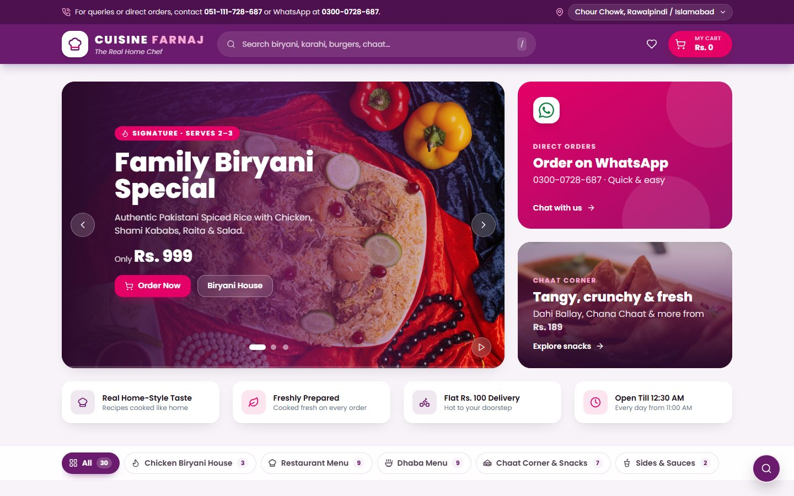
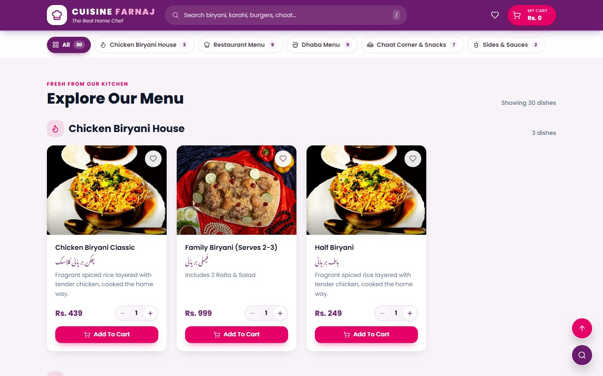
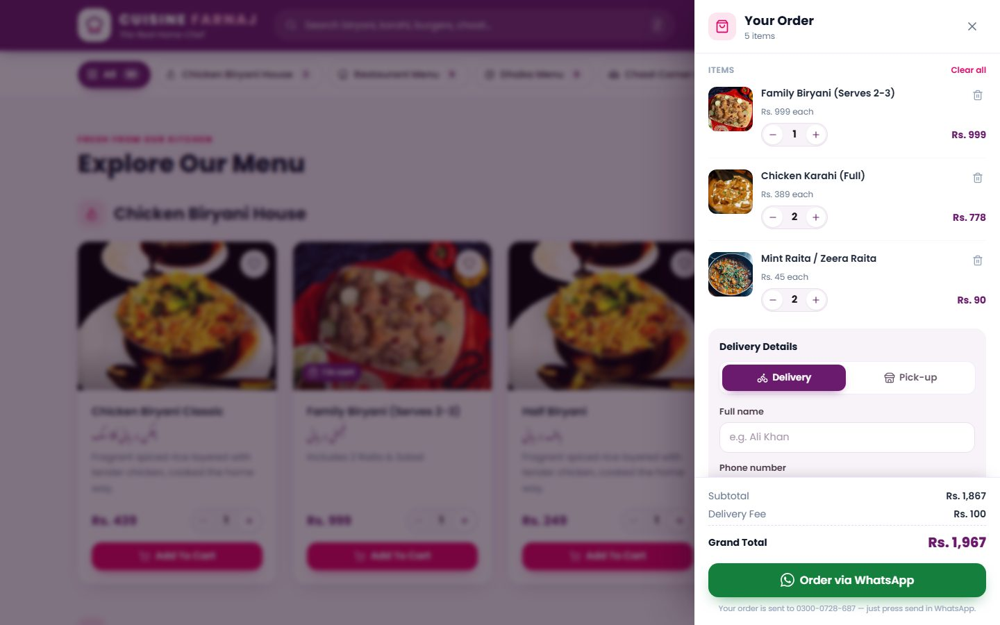
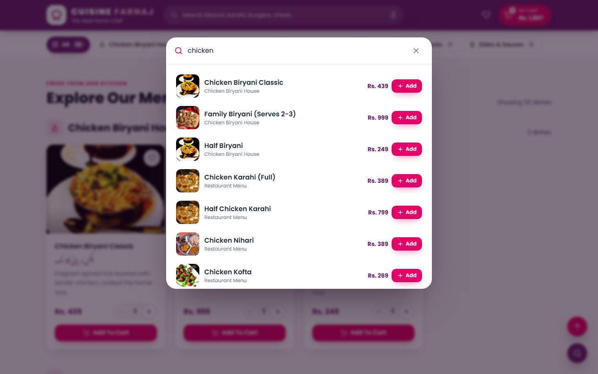
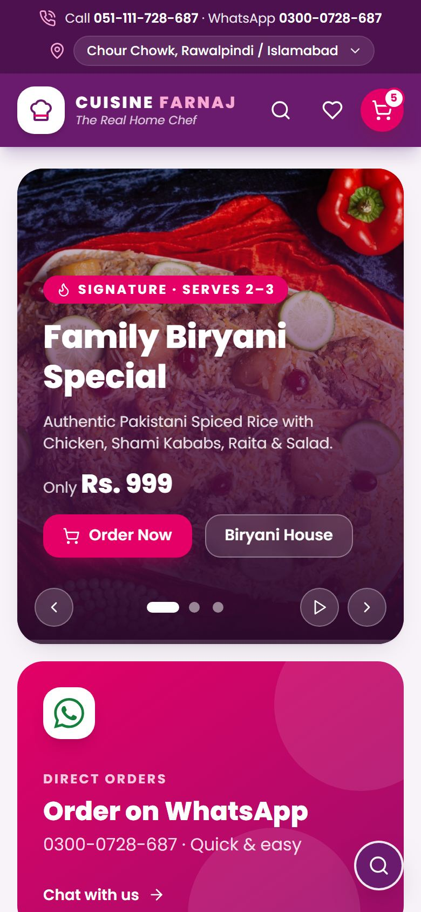
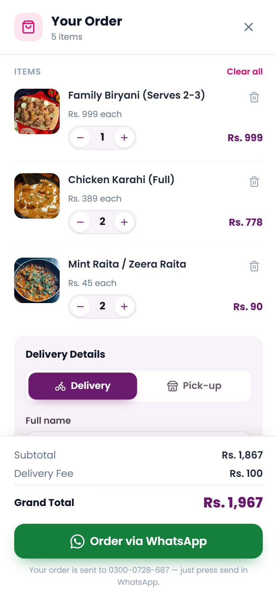

<div align="center">

# 🍛 Cuisine Farnaj — The Real Home Chef

**A modern, responsive online food-ordering website for a home-style restaurant in Rawalpindi / Islamabad.**

Browse the menu, filter by category, build a cart and send the order straight to the restaurant on **WhatsApp**. No backend, no build step.




</div>

---

## 📑 Table of Contents

- [Features](#-features)
- [Screenshots](#-screenshots)
- [Tech Stack](#-tech-stack)
- [Project Structure](#-project-structure)
- [Getting Started](#-getting-started)
- [Customization](#-customization)
- [How WhatsApp Checkout Works](#-how-whatsapp-checkout-works)
- [Deployment](#-deployment)
- [Accessibility & Performance](#-accessibility--performance)
- [Known Notes / To-Do](#-known-notes--to-do)
- [License](#-license)

---

## ✨ Features

| Area | What it does |
| --- | --- |
| **Announcement bar** | Helpline and WhatsApp numbers, plus a location selector (*Chour Chowk, Rawalpindi / Islamabad* or *Self Pick-up*). |
| **Sticky navbar** | Logo, search bar, wishlist and a cart button with a live item count and running total. |
| **Hero carousel** | Three signature dishes. Auto-plays every 4 s with arrows, dots, a progress bar, pause/play, swipe and keyboard arrows. It pauses on hover. |
| **Sticky category tabs** | `All`, `Chicken Biryani House`, `Restaurant Menu`, `Dhaba Menu`, `Chaat Corner & Snacks`, `Sides & Sauces`. Filters the menu instantly without reloading. |
| **Menu cards** | Photo, wishlist heart, English and Urdu names, description, price in **Rs.**, a quantity stepper and a pink **Add To Cart** button. |
| **Cart drawer** | Slides in from the right. Change quantities, remove items, and see the subtotal, **Rs. 100 delivery fee** and grand total update live. |
| **WhatsApp checkout** | Validates name, phone and address, then opens WhatsApp with the full order message already written. |
| **Delivery or pick-up** | Pick-up removes the delivery fee and hides the address field. |
| **Search** | Opens with `/` or `Ctrl + K`. Matches dish names in English and Urdu, lets you add items directly, or jumps to a dish and highlights it. |
| **Wishlist** | Save favourite dishes and add them to the cart later. |
| **Find Us** | Embedded Google Map, directions and call buttons. |
| **Footer** | Contact details, opening hours with a live **Open now / Closed** badge (Pakistan time), menu links, social links and legal links. |
| **Floating controls** | Search button and a smooth-scrolling **Back to Top** button. |
| **Saved between visits** | Cart, wishlist, order type and customer details are stored in `localStorage` and kept in sync across open tabs. |

---

## 📸 Screenshots

<table>
  <tr>
    <td width="50%"><p align="center"><b>Menu grid & sticky category tabs</b></p></td>
    <td width="50%"><p align="center"><b>Cart drawer & WhatsApp checkout</b></p></td>
  </tr>
  <tr>
    <td width="50%"><p align="center"><b>Instant menu search</b></p></td>
    <td width="50%">
      <table>
        <tr>
          <td></td>
          <td></td>
        </tr>
      </table>
      <p align="center"><b>Mobile layout</b></p>
    </td>
  </tr>
</table>

---

## 🛠 Tech Stack

- **HTML5**: semantic markup with ARIA roles for dialogs, the carousel and live regions
- **[Tailwind CSS](https://tailwindcss.com/)** (Play CDN): utility classes with brand colours set in `tailwind.config`
- **Custom CSS** (`styles.css`): components, animations, drawers, toasts and reduced-motion support
- **Vanilla JavaScript**: no framework and no build step
- **[Lucide Icons](https://lucide.dev/)**: pinned to `lucide@0.460.0`
- **Google Fonts**: *Poppins* for the UI and *Noto Nastaliq Urdu* for Urdu names

### Brand palette

| Token | Hex | Used for |
| --- | --- | --- |
| Deep Purple | `#6B1B6D` | Header, footer, active states |
| Darker Purple | `#4E1150` | Announcement bar, gradients |
| Magenta Pink | `#E40066` | Buttons, badges, highlights |
| Lavender Off-White | `#F7F3F8` | Page background |
| White | `#FFFFFF` | Cards (`rounded-2xl`, soft shadow) |

---

## 📁 Project Structure

```text
Farnaj_Restuarant_Demo/
├── index.html              # Page markup: top bar, navbar, hero, menu, drawers, footer
├── styles.css              # Custom components, animations and responsive tweaks
├── scripts/
│   ├── menuData.js         # Menu items and prices, categories, site config, helpers
│   ├── ui.js               # Shared helpers: safe storage, drawer/modal controller, toasts
│   ├── carousel.js         # Hero carousel (auto-play, dots, arrows, swipe)
│   ├── cartManager.js      # Cart state, cart drawer and WhatsApp checkout
│   └── app.js              # Menu grid, category filter, wishlist, search, header
├── docs/
│   └── screenshots/        # Images used in this README
├── .editorconfig
├── .gitignore
├── LICENSE
└── README.md
```

Scripts are plain `<script defer>` files that load in this order:
`menuData.js → ui.js → carousel.js → cartManager.js → app.js`.
Because they aren't ES modules, the site also works when `index.html` is opened directly from disk.

---

## 🚀 Getting Started

### Option 1: Open directly

```bash
git clone https://github.com/abdullahskills26-eng/Farnaj_Restuarant_Demo.git
cd Farnaj_Restuarant_Demo
```

Then double-click **`index.html`** to open it in any modern browser.

### Option 2: Run a local server (recommended)

```bash
# Node.js
npx serve .

# or Python 3
python -m http.server 8000
```

Open <http://localhost:8000> (or the URL `serve` prints).

> **Note:** An internet connection is needed for Tailwind, fonts, icons, the map and the Unsplash food photos.

---

## 🎨 Customization

### Contact details, delivery fee and WhatsApp number

Edit `SITE_CONFIG` in [`scripts/menuData.js`](scripts/menuData.js):

```js
const SITE_CONFIG = {
  brand: "Cuisine Farnaj",
  phone: "051-111-728-687",
  whatsappNumber: "923000728687", // international format used by wa.me
  email: "orders@farnaj.com.pk",
  deliveryFee: 100,
  currency: "Rs.",
  // ...
};
```

> Phone numbers, the address and timings also appear as text in `index.html`. Update them there as well.

### Add or change a dish

Add an object to the `menuData` array. `desc` is optional; if it's missing, the card shows a short description based on the category.

```js
{ id: 31, category: "Dhaba Menu", name: "Aloo Paratha", urdu: "آلو پراٹھا", desc: "Served with raita", price: 180, image: "https://..." }
```

### Add a category

1. Add the name to `CATEGORIES`.
2. Add an icon to `CATEGORY_ICONS` (any [Lucide](https://lucide.dev/icons) icon name).
3. Optionally add a fallback description to `CATEGORY_BLURBS`.

The tabs, counts and grid sections are generated automatically.

---

## 💬 How WhatsApp Checkout Works

1. The customer adds dishes and opens the cart.
2. They choose **Delivery** or **Pick-up** and enter their name, phone and address (the address is only required for delivery).
3. **Order via WhatsApp** opens `https://wa.me/923000728687?text=...` with a message like this:

```text
*New Order - Cuisine Farnaj*
Order Type: Home Delivery

*Items:*
1. Family Biryani (Serves 2-3) x 1 = Rs. 999
2. Chicken Karahi (Full) x 2 = Rs. 778

Subtotal: Rs. 1,777
Delivery Fee: Rs. 100
*Grand Total: Rs. 1,877*

*Customer Details:*
Name: Ali Khan
Phone: 0300-1234567
Delivery Address: House 12, Street 4, Satellite Town, Rawalpindi
```

4. The customer presses **Send** in WhatsApp, and the restaurant receives the order.

---

## 🌐 Deployment

This is a fully static site, so it can be hosted anywhere.

**GitHub Pages**

1. Go to **Settings → Pages** in this repository.
2. Under *Build and deployment*, choose **Deploy from a branch**, then select **`main`** and the **`/ (root)`** folder.
3. Save. After a minute the site is live at
   `https://abdullahskills26-eng.github.io/Farnaj_Restuarant_Demo/`

It also works on **Netlify** or **Vercel**: import the repo, leave the build command empty and set the publish directory to `/`.

---

## ♿ Accessibility & Performance

- Drawers and search keep keyboard focus inside while open, close with `Esc` and return focus to the button that opened them.
- The carousel has a pause button and pauses on keyboard focus.
- `prefers-reduced-motion` turns off animations and smooth scrolling.
- Screen readers announce cart and search updates through live regions.
- Images below the first screen load lazily. If a photo fails to load, a branded placeholder is shown.
- The layout works from 320 px phones up to large desktops with no horizontal scrolling.
- If `localStorage` is blocked (e.g. private browsing), the site still works for the current visit.

---

## 📝 Known Notes / To-Do

- [ ] Replace the placeholder **Facebook** and **Instagram** links (marked `TODO` in `index.html`).
- [ ] Link **Privacy Policy**, **Terms & Conditions** and **Refund Policy** to real pages.
- [ ] Confirm the **Chicken Karahi** prices. The data lists *Full* at Rs. 389 and *Half* at Rs. 799, which may be swapped.
- [ ] Confirm the address. The footer says *Main Peshawar Road, Near Kainat Travels*, while the Google Maps pin is at *CB-175 Lane 3, near Radio Pakistan*.
- [ ] Replace the stock Unsplash photos with real dish photography.
- [ ] For production, compile Tailwind with the [Tailwind CLI](https://tailwindcss.com/docs/installation) instead of the Play CDN.

---

## 📄 License

Released under the [MIT License](LICENSE) © 2026 Muhammad Abdullah.

<div align="center">

**Cuisine Farnaj** · 051-111-728-687 · WhatsApp 0300-0728-687 · orders@farnaj.com.pk
<br>
Monday – Sunday: 11:00 AM – 12:30 AM

</div>
